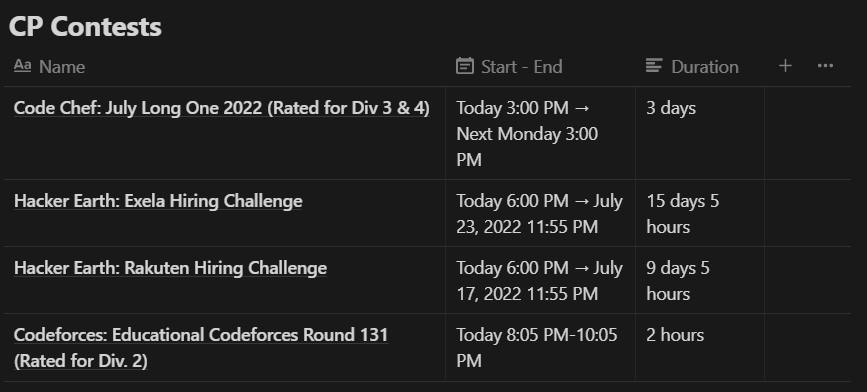

# CP Scheduler Notion

An automation to add upcoming and ongoing competitive programming contests to a notion database written in 
[Python 3](https://www.python.org/) using [Notion API](https://developers.notion.com/reference/) and 
[Kontests API](https://kontests.net/api).

### Preview:

### Requirements:
- Python 3.xx
- Notion Internal Integration Token
- Notion Dataset/Database ID
